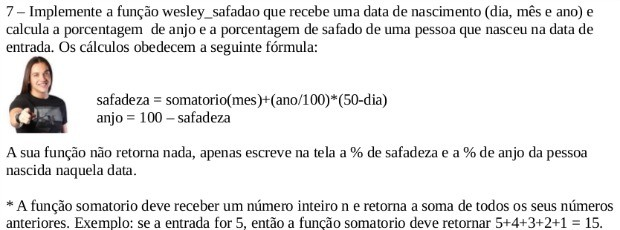

# safadômetro

> Polyglot implementations of *"safadeza"* calculus.

## Table of Contents

- [The Problem](#the-problem)
- [Motivation](#motivation)
- [Contributing](#contributing)
- [Status](#status)
- [License](#license)

## The Problem

Sometimes, you want to know how **safad(o/a)** - a Brazilian Portuguese word for
*naughty* - someone is. A very popular Brazilian musician desbribes himself as
being `99%` an angelical and perfect person; but the other `1%` is naughty - as
you can see [in the lyrics](http://www.vagalume.com.br/marcos-e-belutti/aquele-um-por-cento-part-wesley-safadao.html).

A very clever professor from a state university in Brazil proposed a way o calculing
how *safado* some is based on his/her date of birth.

The *magical formula* needs:

- A `sum` function which takes an `int` a returns the sum of it with all its
previous positive integers, e.g. `sum(5)= 5+4+3+2+1`.

- A `safadeza` function which is given by:

  `safadeza = sum(month) + (year / 100) * (50 - day)`

- An `angel` function which is given by:

  `angel = 100 - safadeza`

So this repo is for writing code that shows others how *safado* they are.

I look forward to seeing what you come up with c:

## Motivation

> The programming question which quotes Wesley Safadão and turned to be a hit
on the web.

It all started when a professor from the Quixadá campus of the Federal University
of Ceará - *Universidade Federal do Ceará (UFC)* - Jefferson de Carvalho called
everyone's attention by using a hit of the *sertanejo * and *forró music* to teach
imperative programming logic to his students.

He was inspired by the song *[Aquele 1%](http://www.vagalume.com.br/marcos-e-belutti/aquele-um-por-cento-part-wesley-safadao.html)*,
which is a success from the duo Marcos & Belutti featuring a very popular
Brazilian musician, Wesley Safadão, to write his logical challenge.

> If you'd like to find out more content about this funny story, [there are](http://g1.globo.com/ceara/noticia/2015/12/professor-cita-wesley-safadao-em-questao-de-logica-e-vira-hit-na-web.html)
[lots](http://revistagalileu.globo.com/blogs/buzz/noticia/2015/12/professor-universitario-usa-wesley-safadao-em-prova-de-programacao.html)
[of](http://gazetaonline.globo.com/_conteudo/2015/12/entretenimento/cultura_e_famosos/3917154-professor-cita-wesley-safadao-e-questao-de-logica-e-bomba-na-web.html)
[good resources](http://www.opovo.com.br/app/divirta-se/2015/12/04/noticiasdivirtase,3544424/professor-da-ufc-elabora-questao-de-prova-fazendo-referencia-a-wesley.shtml)
[on the web](http://www.ibahia.com/detalhe/noticia/professor-cita-wesley-safadao-em-questao-de-prova-e-faz-sucesso/?cHash=74e1cc909aa2269eb81a4401b282d892)
[about it](http://maisregiao.com.br/professor-cita-wesley-safadao-em-questao-de-prova-e-faz-sucesso/).

## Contributing

### Adding a New Implementation

1. Just think of your own interpretation of the problem.
1. Fork this project!
1. Create a new folder with the name of the language you've used in your solution, e.g. `javascript/`
1. **Put the implementation and the example in separated files**
1. Tick the language - with `- [x]` in *GitHub Flavored Markdown* - in which
you've implemented [here](STATUS.md)
1. Commit your changes: `git commit -m 'Add JavaScript version'`
1. Push to the branch: `git push origin master`
1. Submit a pull request :)

### Adding a New Language

1. Fork this project!
1. Add the language to the [languages tracking file](STATUS.md) - **don't forget to obey alphabetical order**.
1. Commit your changes: `git commit -m 'Add JavaScript to listed languages'`
1. Push to the branch: `git push origin master`
1. Submit a pull request :)

## Status

You can check a list of languages in which the problem's been implemented - or
should've been - [here](STATUS.md).

## License

[safadometro](https://github.com/mabrasil/safadometro) is distributed under the
MIT License, available in this repository. All contributions are assumed to be also licensed under
the MIT License.
